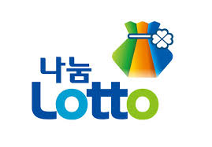

# 로또 당첨번호 테이블 

- 1회부터 최근까지 로또 당첨번호를 원페이지로 만드는 토이 프로젝트
- 만들어진 로또 테이블을 이용하여 원페이지 사이트를 gitpage로 생성
- Google Ad고시에 한번 붙어보자

## 개발 언어 & 환경
- Go
- Github Action(cron)
- Hugo or html + css
- gitpage

## 개발 방향
- Github Action Cron을 이용하여 매주 토요일 로토 번호를 갱신
- dhlottery.co.kr 사이트의 https://dhlottery.co.kr/gameResult.do?method=allWin 페이지를 최근회 ~ 회까짜 크롤링
- 당첨번호는 10개씩 게시판 형식으로 제공

## TODO
- [ ] 게시판에서 데이터를 크롤링하여 결과를 markdown 테이블로 저장
- [ ] hugo를 이용하여 저장된 당첨번호 테이블을 웹 페이지로 빌드
- [ ] github action을 이용하여 cron을 이용하여 반복 작업 처리

## memo
- [ ] 로또의 마지막 번호는 변수로 저장
